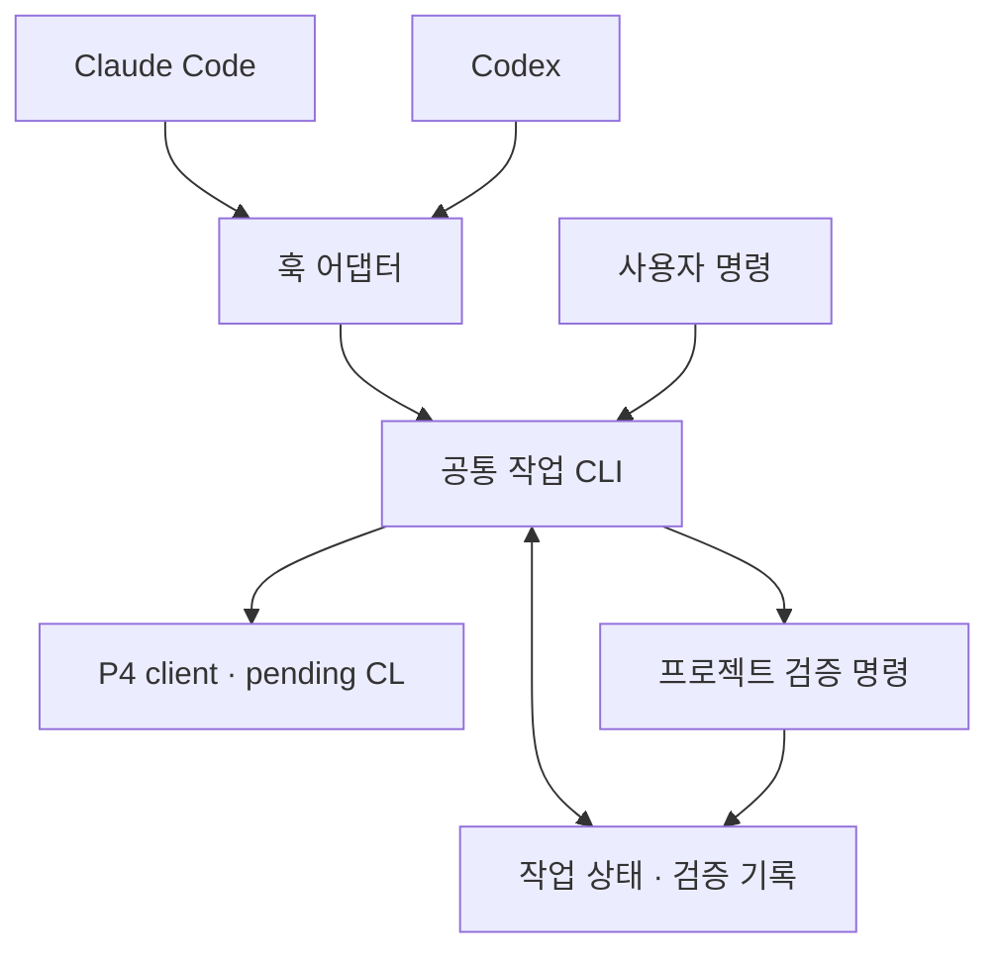

# 구조와 설계 결정

두 제품의 프롬프트에 P4 명령을 따로 복제하면 작업 소유권, CL, 검증 기준이 서로 달라지기 쉽습니다. 이 하네스는 규칙과 실행 코어를 공유하고 제품별 차이는 훅 입력·설치 경로에 둡니다.

## 파일 책임

| 파일 | 책임 |
|---|---|
| `p4h.py` | 패키지 설치 없이 실행하는 진입점 |
| `common.py` | 물리 경로·scope 검사, JSON atomic write, OS 파일 lock |
| `p4.py` | `-d`, 명시적 client/port/user, `-ztag -G` 실행·오류 처리 |
| `workflow.py` | 작업 CL, checkout·add·delete·move, manifest, 인계·shelf·완료 |
| `checks.py` | argv 기반 검증, timeout, 로그, snapshot에 연결된 결과 |
| `hooks.py` | 두 제품의 이벤트를 공통 작업으로 변환 |
| `install.py` | 기존 설정 병합·백업과 두 어댑터 설치 |
| `templates/` | 두 제품에 배포하는 공통 규칙과 skill |

## 핵심 불변 조건

1. **작업의 기준은 CL과 물리 파일이다.** `begin`은 client/root/user/view와 scoped have revision을 기록합니다. Git branch/worktree 개념을 P4에 그대로 적용하지 않습니다.
2. **쓰기 전 파일 소유권을 확보한다.** 기존 파일은 작업 CL로 `edit`, 새 파일은 경로를 예약합니다. 이미 다른 CL에서 열린 파일을 자동으로 가져오지 않습니다.
3. **한 client/root에서 한 세션만 작성한다.** 첫 변경 훅에서 session ID를 기록하고 명시적 `handoff`/`resume`로 소유권을 넘깁니다. OS lock은 각각의 하네스 명령을 직렬화합니다. 외부 편집까지 잠그지는 않습니다.
4. **검증은 특정 상태의 증거다.** snapshot은 CL·환경·base have·파일 action/type/hash를 포함합니다. 검증 전후 snapshot과 검증 profile hash를 비교하며, `finish`는 required check마다 현재 snapshot을 요구합니다.
5. **실패해도 기존 소스를 버리지 않는다.** 인증 실패, +l lock, 매핑 변화, timeout은 오류로 남깁니다. 복구를 위한 자동 revert/sync는 없습니다.

## P4 실행 방식

P4 server 명령과 form 입출력은 공식 Python marshal 형식인 `-G`와 tagged output을 사용합니다. 오류 record를 exit code와 함께 검사하며, 조회 명령에서 명시적으로 허용한 empty 결과만 빈 목록으로 취급합니다. `p4 set P4IGNORE`는 `-G`에서도 plain text를 반환하므로 별도 처리합니다. [P4 global options](https://help.perforce.com/helix-core/server-apps/cmdref/current/Content/CmdRef/global.options.html).

명령은 shell 문자열 없이 argv로 실행하고 모든 P4 호출에 `-d <workspace root>`를 지정합니다. 이는 호출 프로세스의 cwd/PWD와 P4CONFIG 검색 기준이 달라지는 문제를 방지합니다. `@`, `#`, `%`는 일반 filespec에서 escape하며, 새 파일 추가는 필요한 경우 `add -f`에 원래 파일명을 전달합니다. reconcile은 `-n` preview만 사용합니다. `-I`로 ignore를 무시하지 않습니다. [P4 add](https://help.perforce.com/helix-core/server-apps/cmdref/current/Content/CmdRef/p4_add.html), [P4 reconcile](https://help.perforce.com/helix-core/server-apps/cmdref/current/Content/CmdRef/p4_reconcile.html).

## 의도적인 경계

- 현재 client의 실제 root에서 동작합니다. client 생성·stream 변경·integrate/resolve·sync·submit은 기존 운영 절차에 맡깁니다. 이미 매핑된 stream client도 사용할 수 있으나 복잡한 매핑은 실제 환경에서 먼저 확인합니다.
- 동일 물리 파일에 두 agent의 작성 작업을 병렬 실행하지 않습니다. 별도 client/root 간 unshelve·통합은 이번 버전의 자동 인계 범위 밖입니다.
- shell 명령의 정규식 검사는 흔한 실수를 막는 보조 장치입니다. wrapper·alias·임의 Python·MCP 도구를 통한 모든 쓰기를 보장해서 막지는 못합니다.
- snapshot은 선택한 scope와 기록된 P4 상태를 검증합니다. 범위 밖 dependency, 외부 서비스, 무시된 산출물까지 재현성을 보증하는 attestation은 아닙니다. 테스트에 필요한 관련 소스를 scope에 포함하세요.
- provider 훅이 비활성화·미신뢰 상태이거나 상위 조직 정책에 의해 로딩되지 않으면 자동 준비는 작동하지 않습니다. [최초 설치 확인](testing.md#실제-제품에서-설치-확인)을 수행하세요.

## 확장 방향

프로젝트별 build/lint/test를 config에 등록하는 것부터 시작합니다. 이후 실제 요구가 생기면 별도 client 생성과 shelf 인계를 담당하는 orchestration, 회사 리뷰 시스템 연결, remote validation을 추가할 수 있습니다. 각 기능은 공통 상태/검증 코어 위에 명시적 명령으로 추가합니다.
