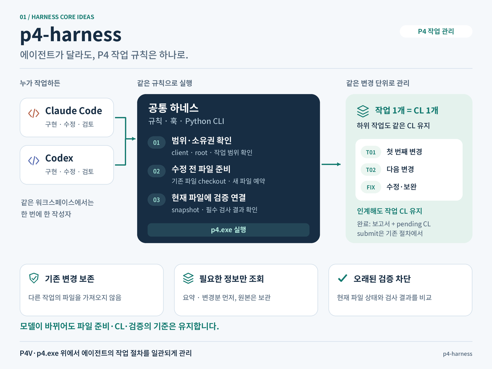

# p4-harness 핵심 아이디어

**에이전트가 바뀌어도 P4 파일 준비·CL·검증의 기준을 유지합니다.**

[PNG 이미지](images/core-ideas.png) · [수정 가능한 SVG 원본](images/core-ideas.svg)

왼쪽에서 오른쪽으로 작업 주체, 공통 실행 규칙, 변경 관리 단위를 읽으면 됩니다.

1. **Claude와 Codex가 같은 규칙을 사용합니다.** Python 도구가 `p4.exe`를 실행하면서 작업 범위·소유권을 확인하고, 기존 파일 checkout과 새 파일 예약을 일관되게 처리합니다. P4V가 설치되어 있어도 에이전트의 반복 절차를 이 도구에 맡길 수 있습니다.
2. **한 작업은 같은 CL에서 이어갑니다.** 하위 작업이나 수정·인계 때문에 새 CL을 만들지 않습니다. 같은 물리 워크스페이스에서는 한 번에 한 작성자만 작업합니다. `finish`는 보고서와 pending CL을 남기며 submit은 기존 절차에서 수행합니다.
3. **판단에 필요한 정보와 현재 검증을 제공합니다.** 요약·변경분·실패 로그를 먼저 조회하고 원본은 보존합니다. 현재 파일 상태와 필수 검사 결과를 연결해, 파일이 바뀐 뒤 오래된 검증으로 완료하는 일을 막습니다. 프로젝트 검사를 등록하지 않았다면 검증 통과로 간주하지 않고 `not_configured`로 보고합니다.

그림의 순서는 핵심 역할을 요약한 것입니다. 실제 명령 순서와 인계·복구 절차는 [작업 흐름](workflow.md), Python 도구와 P4V의 역할 및 토큰 절감 설계는 [토큰 효율 설계](token-efficiency.md)를 참고하세요.

계획·수행·리뷰 순서는 별도 [jsonl-prr](https://github.com/jaywapp/jsonl-prr)가 담당합니다. 함께 사용할 때는 [역할 경계](workflow-boundary.md)를 따릅니다.

이미지는 1600 × 1200 PNG와 텍스트를 편집할 수 있는 SVG로 제공합니다. SVG의 한글 글꼴은 Noto Sans KR이며, 설치되어 있지 않으면 시스템 한글 글꼴로 표시됩니다.
